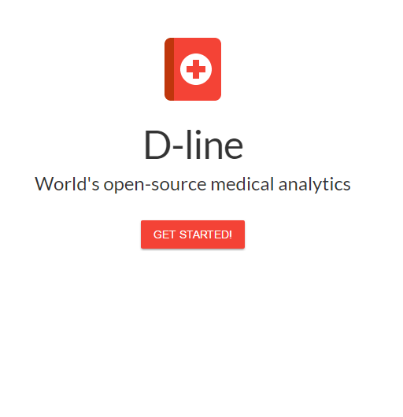
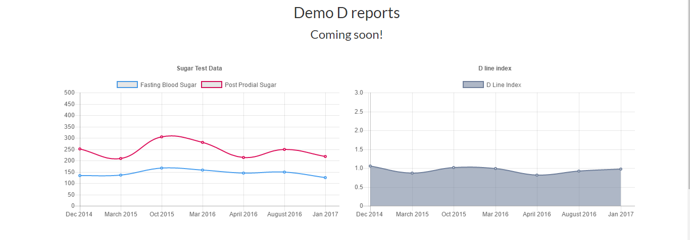

# D-line

D-line is just a personal thought ended up being a repository here. Its currently in development. The functions and features will be elaborated when time comes but as of now you can settle it as an analysis of your medical report which virtualised the results in the form of charts enabling you understand the better YOU.

Demo link: http://www.mohammadshahebaz.com/dline/

Peace
